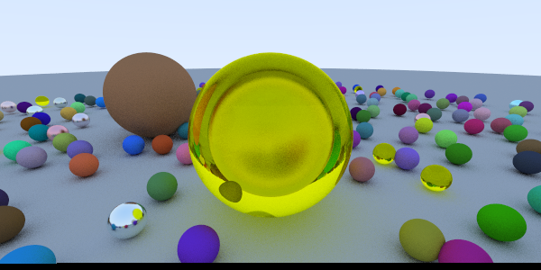
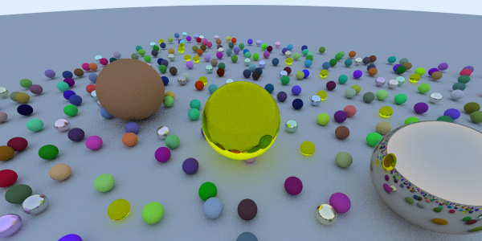

# Raytracer

This is my implementation of the famous paper "Ray Tracing In One Weekend" by Peter Shirley. It's a brute force Monte Ray Tracer created from scratch without the use of any external libraries or 3D API. For each pixel of the image, we shoot a ray in the direction of the scene and depending on the material of the surface on the hit point, we choose how to bounce that ray using pseudo-random functions.

# CUDA
The down side of this implementation is that it takes a lot of time to generate one picture with a medium resolution and that's due to the enormous amount of operations done by the CPU in a sequential way. The best way to solve this is by making my code run on the GPU and parallelize the computation. I chose CUDA to do so and I'm currently working on transforming the project to to make it work on the GPU. Switch to the CUDA branch to see the modifications.

# Output

